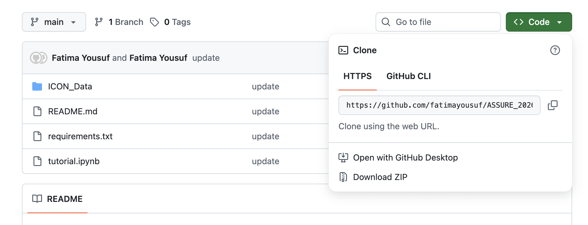

# ASSURE 2026 Small Group Project

Welcome to the ASSURE REU program! In this group project, we will learn how to run data analyses with satellite data from the Ionospheric Connection Explorer (ICON) mission. ICON was a satellite mission designed to investigate the ionosphere of Earth. The ionosphere is part of Earth's atmosphere, and it consists of free electrons and charged particles called ions. The ionosphere is of practical importance for several reasons, among which is its influence on radio propagation. Radio waves going to and from satellites like GPS and communications satellites can be deflected or absorbed by ions in the ionosphere. So, understanding how the ionosphere works and changes over time is both scientific and practical interest. 

There are four main instruments on ICON: 

- Michelson Interferometer for Global High-Resolution Thermospheric Imaging (MIGHTI)
- Ion Velocity Meter (IVM)
- Extreme Ultra-Violet (EUV)
- Far Ultra-Violet (FUV)

In this project, we will be working with ICON-IVM data. IVM measures the velocities of ions around the ICON spacecraft. This information is useful because it can also help tell you the strength of the electromagnetic field in the space around the satellite.

## Downloading the Tutorial Files to Your Local Computer

To complete this tutorial, you will need to download the tutorial files in this repository to your local computer. Github/git is commonly used across multiple fields like software engineering and space sciences research, so it will be good for you to become familiar with using this system if you aren't already. 

You will first need to install git on your computer if it is not installed already. You can check out this website `https://git-scm.com/install/mac` for more information on how to do this. 

Then, go to `https://github.com/fatimayousuf/ASSURE_2026`. Towards the top right of the screen, there should be a green button that says "Code." Click on it, and then there should be a URL like `https://github.com/fatimayousuf/ASSURE_2026.git`. Copy that URL.

Then, in your terminal, navigate to the directory where you want to download the files. Run the following command:

`git clone https://github.com/fatimayousuf/ASSURE_2026.git`

You should see that the github files have now been downloaded to your computer! 

Open the file `tutorial.ipynb` with Jupyter Notebook. For the rest of this session, you will be completing this tutorial.